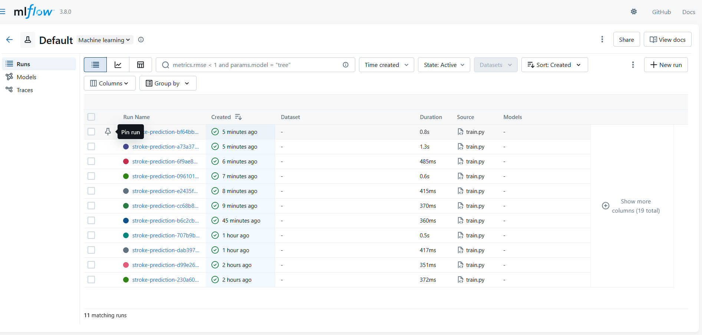
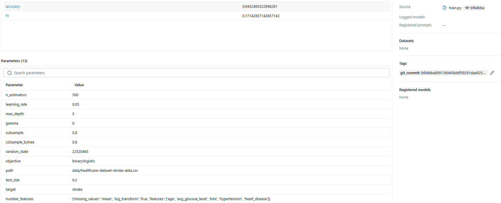

# Stroke Prediction - MLOps Project

## 📋 Tổng quan

Dự án dự đoán đột quỵ sử dụng machine learning với quy trình MLOps. Bài toán **tabular data classification** nơi **feature engineering** và **hyperparameter tuning** cực kỳ quan trọng.

## 🎯 Thách thức

Trong tabular data, cần quyết định:
- **Missing values**: `mean`, `median`, `most_frequent`, hay `remove`?
- **Categorical encoding**: `one_hot`, `label`, hay `target` encoding?
- **Hyperparameters**: `n_estimators`, `learning_rate` bao nhiêu?

## 🛠️ Kiến trúc MLOps

- **MLflow**: Track experiments, metrics, parameters
- **DVC**: Track data & models (large files)
- **Git**: Track code & config files

```
Git → DVC → MLflow
```

## 📦 Cài đặt

```powershell
python -m venv venv
venv\Scripts\activate.ps1
pip install -r requirements.txt
git init
dvc init
dvc add .\data\healthcare-dataset-stroke-data.csv
git add 'data\healthcare-dataset-stroke-data.csv.dvc' 'data\.gitignore'
git commit -m "dvc track data"
```

## 🚀 Sử dụng

### DVC Pipeline

File `dvc.yaml` định nghĩa: khi `deps` thay đổi → tự động chạy `cmd` → tạo model mới.

```powershell
dvc repro  # Chạy training nếu deps thay đổi
```

Sau đó commit lại:

```powershell
git add .
git commit -m "third ex"
```

## 🔬 Quy trình Thí nghiệm

1. **Thay đổi `config.yaml`** (missing_values, encoding, hyperparameters)
2. **Chạy**: `dvc repro` → MLflow tự động track parameters & metrics
3. **Commit**: `dvc add dvc.lock && git commit -m "Experiment: ..."`
4. **Xem kết quả**: `mlflow ui` → `http://localhost:5000`

### MLflow UI

**Tổng hợp các thí nghiệm:**


**Chi tiết một thí nghiệm:**


## 🔄 Khôi phục Thí nghiệm Cũ

Mỗi thí nghiệm gắn với Git commit ID. Để xem lại:

```powershell
git checkout <commit-id>
dvc pull  # Pull lại đúng version data & model
```

## 📊 Cấu trúc Project

```
├── config.yaml              # Cấu hình experiments
├── dvc.yaml                 # DVC pipeline
├── dvc.lock                 # Checksums (tracked by Git)
├── src/
│   ├── train.py            # Training với MLflow
│   └── processing_data.py  # Preprocessing
├── data/                    # Tracked by DVC
└── models/                  # Tracked by DVC
```
